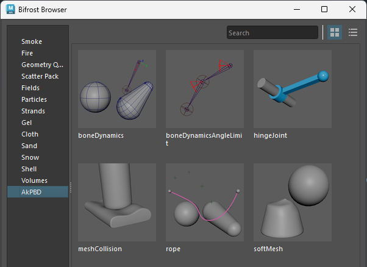

# AkPBD
Compounds for Position Based Dynamics in bifrost

> **Created with:**  
> * Maya 2024.2
> * Bifrost 2.7.1.1

# Installation
Set the path to [`bifrost_lib_config.json`](bifrost_lib_config.json) as `BIFROST_LIB_CONFIG_FILES` in the environment variable. For example, to place the bifrost_AkPBD folder on the D drive, enter the following in Maya.env:
```
BIFROST_LIB_CONFIG_FILES=D:\bifrost_AkPBD\bifrost_lib_config.json
```

# Sample Graphs
Some samples can be accessed from the Bifrost Browser.  


# Related Links  
* [Bifrostではじめる位置ベース物理シミュ 第1回 \~位置ベース法\~](https://qiita.com/akasaki1211/items/54f6009ed3389948f7f0)
* [Bifrostではじめる位置ベース物理シミュ 第2回 \~力を加える・位置を補正する\~](https://qiita.com/akasaki1211/items/d7272303d44d4823b39d)
* [Bifrostではじめる位置ベース物理シミュ 第3回 \~制約条件を追加する\~](https://qiita.com/akasaki1211/items/9d22075df1a51be1ed4c)
* [Bifrostではじめる位置ベース物理シミュ 第4回 \~コリジョンを追加する\~](https://qiita.com/akasaki1211/items/971ccad3c50d88749ba1)
* [Bifrostではじめる位置ベース物理シミュ 第5回 \~ジョイント、カーブ、メッシュ\~](https://qiita.com/akasaki1211/items/39440c98e54999673ecf)
